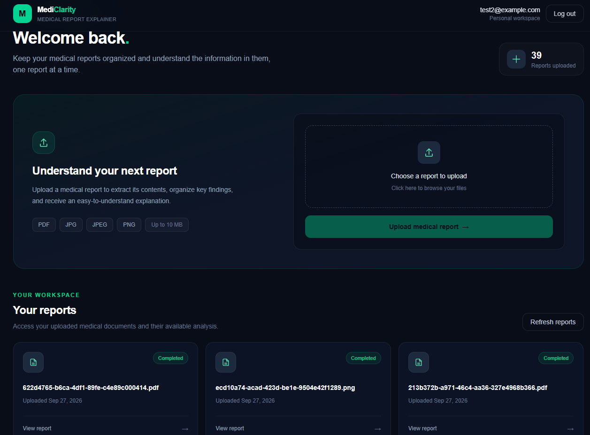
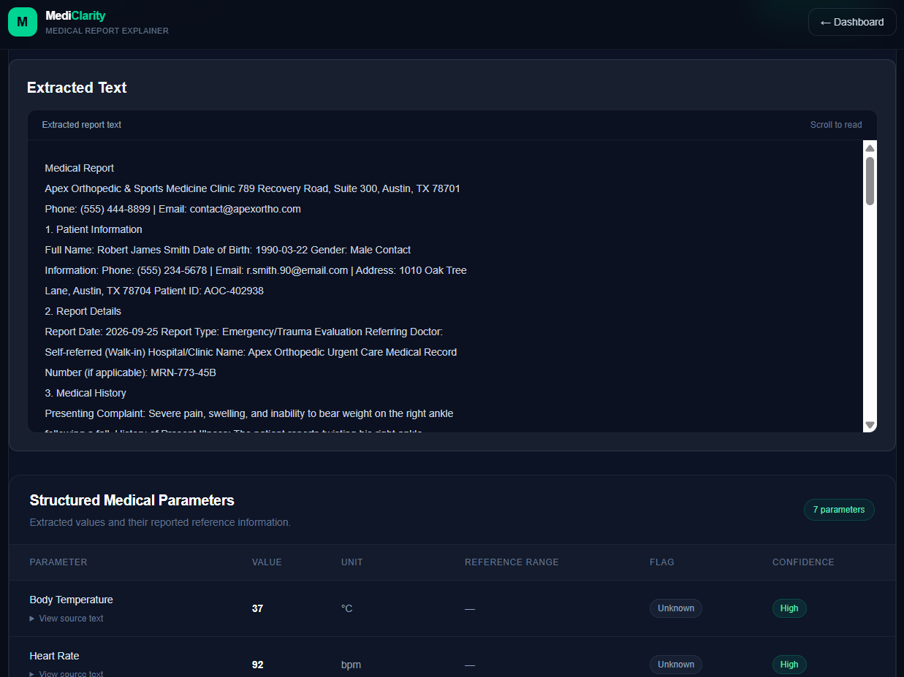
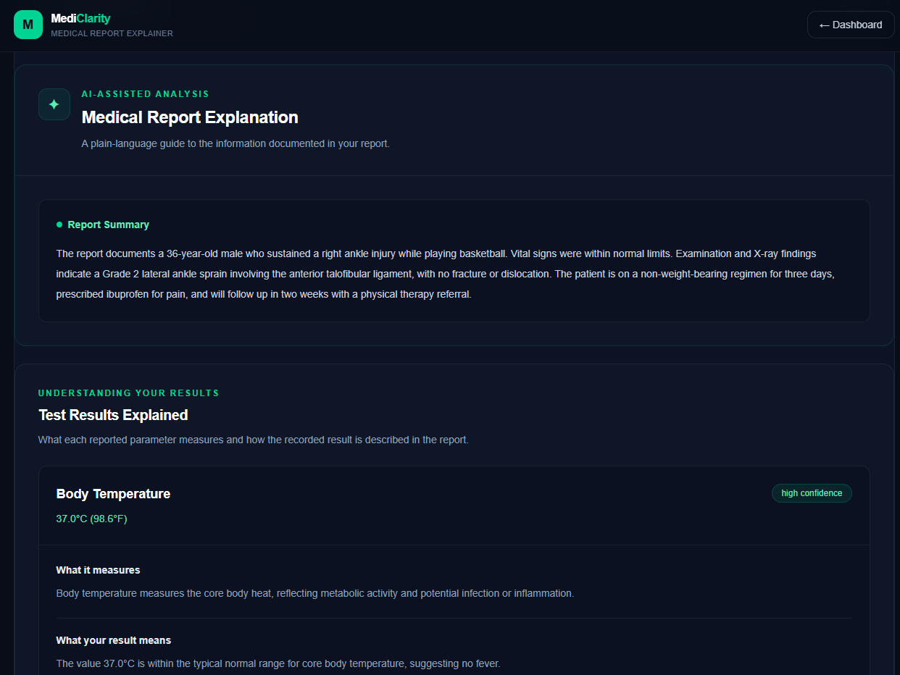
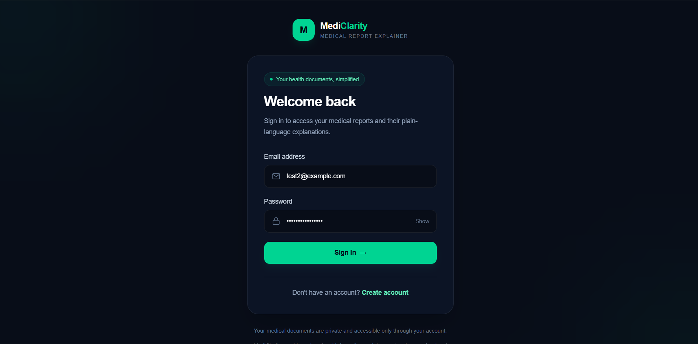
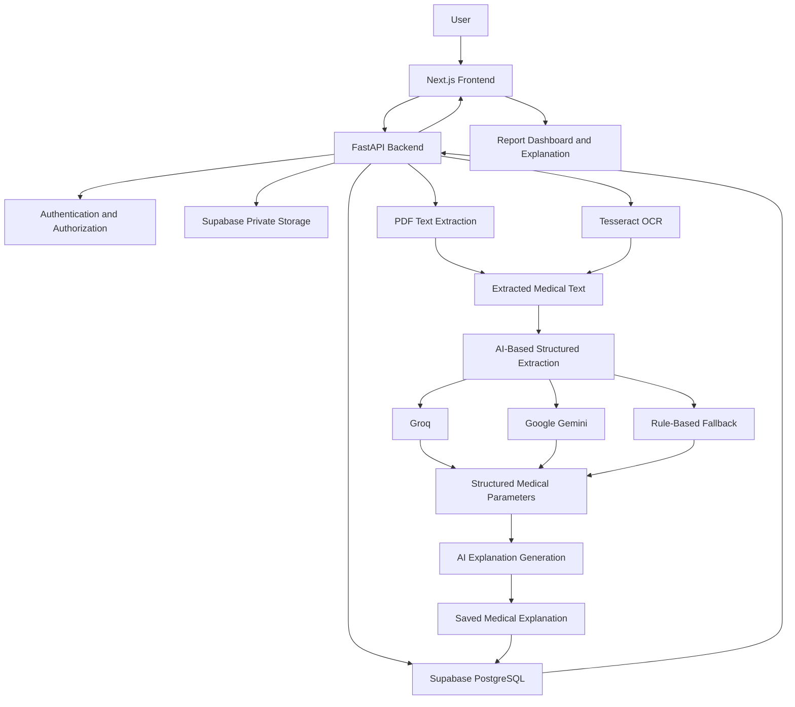

# MediClarity — Medical Report Explainer

**Understand your medical reports in simple, everyday language.**

MediClarity is an AI-powered medical report explanation platform that helps users understand laboratory reports and extracted medical parameters through structured explanations, clinical context, and clear summaries.

The application allows users to upload medical reports, extract their contents using OCR, view structured test results, and generate AI-assisted explanations while preserving the original report information.

> **Live Demo:** [MediClarity](https://medical-report-explainer-lake.vercel.app/)

> **Backend API:** [FastAPI Server](https://medical-report-explainer-backend.onrender.com/docs)

> **API Documentation:** [Swagger UI](https://medical-report-explainer-backend.onrender.com/docs)

---

## Table of Contents

- [Overview](#overview)
- [Features](#features)
- [Application Screenshots](#application-screenshots)
- [Technology Stack](#technology-stack)
- [System Architecture](#system-architecture)
- [How It Works](#how-it-works)
- [Project Structure](#project-structure)
- [Getting Started](#getting-started)
- [Environment Variables](#environment-variables)
- [Running the Application](#running-the-application)
- [API Endpoints](#api-endpoints)
- [Deployment](#deployment)
- [Medical Disclaimer](#medical-disclaimer)
- [Future Improvements](#future-improvements)
- [Author](#author)

---

## Overview

Medical reports often contain technical terminology, laboratory values, reference ranges, and clinical abbreviations that can be difficult for non-medical users to understand.

MediClarity aims to make these reports more accessible by combining Optical Character Recognition (OCR), structured data extraction, and Large Language Models (LLMs).

Users can upload a medical report and receive:

- Extracted medical text and structured parameters.
- Test-result explanations in plain language.
- Explanations of what individual parameters measure.
- Contextual information about medical terminology.
- A summary of the report and important observations.
- Limitations and uncertainty information where appropriate.

MediClarity is designed as an educational tool to improve health literacy, not as a replacement for professional medical advice.

---

## Features

### 1. Secure User Authentication

- User registration and login.
- Authenticated access to protected resources.
- User-specific report management.
- Backend authorization and ownership validation.

### 2. Medical Report Upload

- Upload medical reports in supported PDF and image formats.
- Store original reports in private Supabase Storage.
- Associate uploaded reports with the authenticated user.
- Retrieve and download original reports securely.

### 3. OCR and Text Extraction

- Extract text from PDF documents using PyMuPDF.
- Extract text from image-based reports using Tesseract OCR.
- Process scanned reports and image uploads.
- Preserve extracted text for review and subsequent analysis.

### 4. Structured Medical Data Extraction

The application extracts available medical parameters into structured fields, including:

| Field | Description |
|---|---|
| Parameter | Name of the medical test or measurement |
| Value | Extracted numeric value, when available |
| Unit | Measurement unit |
| Reference Range | Reference range as provided by the report |
| Flag | Extracted status such as low, high, normal, or critical, when available |
| Confidence | Confidence level associated with extraction |
| Source Text | Original text supporting the extracted parameter |

The application is designed to retain the source information and avoid silently inventing missing reference ranges or values.

### 5. AI-Powered Medical Explanations

MediClarity uses Large Language Models to generate structured, user-friendly explanations.

The explanation includes:

- Report summary.
- Explanation of individual parameters.
- What each test measures.
- What the reported result means in the context of the available information.
- Why the parameter may matter.
- Clinical context explanations, when available.
- Important observations and limitations.

### 6. Multi-Provider AI Fallback

The backend uses a fallback strategy for AI-based extraction:

1. Groq
2. Google Gemini
3. Rule-based extraction fallback

This approach allows the application to attempt alternative extraction methods when a preferred AI provider is unavailable or unsuccessful.

### 7. Report Management and Explanation Retrieval

- View previously uploaded reports.
- Access extracted text and structured results.
- Retrieve saved explanations.
- Download the original uploaded report.
- Handle reports without available explanations through an appropriate empty state.

### 8. Responsive User Interface

- Dark-themed interface with emerald accents.
- Dashboard for accessing uploaded reports.
- Dedicated report details and explanation views.
- Loading, error, and empty states for key operations.

---

## Application Screenshots

Add screenshots of your deployed application in the `screenshots/` directory and update the image paths below.

| Dashboard | Report Details |
|---|---|
|  |  |

| Medical Explanation | Authentication |
|---|---|
|  |  |

*Replace the screenshot placeholders with actual screenshots from the running application.*

---

## Technology Stack

### Frontend

| Technology | Purpose |
|---|---|
| Next.js (App Router) | Frontend framework |
| React | User interface |
| TypeScript | Type safety |
| Tailwind CSS | Styling and responsive design |
| Axios | HTTP requests to the backend |
| Lucide React | UI icons |

### Backend

| Technology | Purpose |
|---|---|
| Python | Backend programming language |
| FastAPI | REST API framework |
| SQLAlchemy | Database ORM |
| Pydantic | Request validation and structured data models |
| PyMuPDF | PDF text extraction |
| Tesseract OCR | Image text recognition |
| Pillow | Image processing |
| Groq API | LLM-based extraction and explanation |
| Google Gemini API | Alternative AI provider |

### Database and Cloud Services

| Technology | Purpose |
|---|---|
| Supabase PostgreSQL | Relational database |
| Supabase Storage | Private medical report storage |
| Render | Backend deployment |
| Vercel | Frontend deployment |
| Git and GitHub | Version control and source code hosting |

---

## System Architecture

MediClarity follows a client-server architecture.



### Architecture Components

- **Frontend:** Provides the user interface for authentication, uploading reports, viewing results, and retrieving explanations.
- **Backend:** Handles authentication, authorization, report processing, OCR, AI integration, and API responses.
- **Database:** Stores application records, user-associated reports, extracted data, and generated explanations.
- **Object Storage:** Stores original medical report files in a private bucket.
- **AI Services:** Assist with structured extraction and generation of educational explanations.

The backend is responsible for communicating with Supabase and external AI providers. Sensitive service credentials are kept on the server and are not exposed to the frontend.

---

## How It Works

### Step 1: User Authentication

The user registers or logs in to access the application. Protected backend operations validate the user's identity and permissions.

### Step 2: Report Upload

The user uploads a supported medical report through the dashboard.

The backend validates the request, associates the report with the authenticated user, and stores the original file in Supabase Storage.

### Step 3: Text Extraction

The backend extracts text from the uploaded report.

- Text-based PDFs are processed using PyMuPDF.
- Image-based reports are processed using Tesseract OCR and Pillow.

The extracted text is retained for subsequent processing and display.

### Step 4: Structured Data Extraction

The extracted text is processed using an AI-assisted extraction pipeline.

The backend attempts extraction through Groq, followed by Google Gemini, and then a rule-based fallback where required.

The resulting parameters are represented using structured data models.

### Step 5: Explanation Generation

The structured results and available report context are used to generate a structured explanation.

The explanation is saved and associated with the report.

### Step 6: Report Review

The user can access the report details page to view:

- Original extracted text.
- Structured medical parameters.
- Reference ranges and extracted flags.
- AI-generated explanations and report summaries.
- Important observations and limitations.

The original report remains available for comparison with the extracted information.

---

## Project Structure

The repository is organized as a monorepo containing the frontend and backend applications.

```text
medical-report-explainer/
│
├── backend/
│   ├── app/
│   │   ├── main.py
│   │   ├── api
│   │   └── core
│   │   └── models
│   │   └── schemas
│   │   └── services
│   │   └── workers
│   ├── migrations/
│   ├── requirements.txt
│   ├── alembic.ini
│   └── .env
│
├── frontend/
│   ├── src/
│   │   ├── app/
│   │   │   ├── dashboard/
│   │   │   ├── login/
│   │   │   └── register/
│   │   │   └── ...
│   │   ├── components/
│   │   ├── context/
│   │   ├── lib/
│   │   ├── services/
│   │   ├── types/
│   │
│   ├── public/
│   ├── package.json
│   ├── eslint.config.mjs
│   ├── .gitignore
│   ├── next-env.d.ts
│   ├── next.config.ts
│   ├── package.json
│   ├── package-lock.json
│   ├── postcss.config.mjs
│   ├── tsconfig.json
│   └── .env.local
│
├── screenshots/
│
├── .gitignore
└── README.md
```

*The tree is a high-level overview. Some folders and files may differ depending on the current implementation.*

---

## Getting Started

Follow these instructions to run MediClarity locally.

### Prerequisites

Install the following before starting:

- Python 3.10 or a compatible version supported by the backend dependencies.
- Node.js and npm.
- Git.
- A Supabase project with PostgreSQL and Storage configured.
- A Groq API key.
- A Google Gemini API key if you want to use the Gemini fallback.

Tesseract OCR must also be installed on your machine and available to the backend.

### 1. Clone the Repository

```bash
git clone https://github.com/Sarthak-Pattnaik/medical-report-explainer.git

cd medical-report-explainer
```

### 2. Backend Setup

Navigate to the backend directory:

```bash
cd backend
```

Create and activate a Python virtual environment.

**Windows:**

```bash
python -m venv venv

venv\Scripts\activate
```

**macOS/Linux:**

```bash
python3 -m venv venv

source venv/bin/activate
```

Install the required dependencies:

```bash
pip install -r requirements.txt
```

Configure the backend environment variables as described in the next section.

Ensure that Tesseract OCR is installed and that its executable is accessible to the backend. If it is not available through the system PATH, configure the executable path in your OCR settings.

Start the backend:

```bash
uvicorn app.main:app --reload
```

The API will be available at:

```text
http://127.0.0.1:8000
```

Interactive API documentation:

```text
http://127.0.0.1:8000/docs
```

### 3. Frontend Setup

Open a new terminal and navigate to the frontend directory:

```bash
cd frontend
```

Install dependencies:

```bash
npm install
```

Create a `.env.local` file in the frontend directory and configure the backend URL:

```env
NEXT_PUBLIC_API_URL=http://127.0.0.1:8000
```

Start the development server:

```bash
npm run dev
```

Open the application at:

```text
http://localhost:3000
```

The frontend communicates with the FastAPI backend using the configured API URL.

---

## Environment Variables

The application uses environment variables to configure database access, cloud storage, AI providers, and API communication.

### Backend Environment Variables

Create a `.env` file inside the `backend/` directory.

The following is a template. Match the variable names to those used in your backend configuration.

```env
# Database
DATABASE_URL=your_supabase_postgresql_connection_string

# Supabase
SUPABASE_URL=https://your-project.supabase.co
SUPABASE_SERVICE_ROLE_KEY=your_service_role_key
SUPABASE_STORAGE_BUCKET=medical-reports

# AI Providers
GROQ_API_KEY=your_groq_api_key
GEMINI_API_KEY=your_gemini_api_key
```

Additional variables may be required depending on the backend configuration.

**Important:** Use the exact variable names from the backend's settings and configuration files. Do not commit actual API keys, database credentials, or service-role keys.

The Supabase service-role key must remain on the backend and must never be exposed through a `NEXT_PUBLIC_` variable.

### Frontend Environment Variables

Create `.env.local` inside `frontend/`.

```env
NEXT_PUBLIC_API_URL=http://127.0.0.1:8000
```

For production, configure the variable in Vercel:

```env
NEXT_PUBLIC_API_URL=https://medical-report-explainer-backend.onrender.com
```

The `NEXT_PUBLIC_` prefix makes the value accessible to frontend code. Only public configuration values should use this prefix.

---

## Running the Application

For local development, run the backend and frontend in separate terminals.

| Service | Command | Local URL |
|---|---|---|
| FastAPI Backend | `uvicorn app.main:app --reload` | `http://127.0.0.1:8000` |
| Frontend | `npm run dev` | `http://localhost:3000` |
| Swagger Documentation | Provided by FastAPI | `http://127.0.0.1:8000/docs` |

Make sure that:

1. The backend environment variables are configured.
2. The database and Supabase Storage are accessible.
3. Tesseract OCR is installed.
4. The frontend API URL points to the running backend.
5. The backend CORS configuration allows the frontend origin.

---

## API Endpoints

The backend exposes REST APIs through FastAPI.

The following table summarizes the principal API operations.

| Operation | Endpoint | Description |
|---|---|---|
| Authentication | `/auth/...` | User registration and login operations |
| Upload Report | `POST /reports/...` | Upload and process a medical report |
| Report Retrieval | `/reports/{report_id}` | Retrieve report information |
| Explanation Retrieval | `GET /reports/{report_id}/explanation` | Retrieve the saved explanation |
| Report Download | `/reports/{report_id}/download` | Download the original report |

The authentication and upload routes are summarized by operation because their exact paths and request schemas depend on the current router implementation.

For the complete list of available routes, HTTP methods, request parameters, and response schemas, refer to the interactive API documentation:

**[Open MediClarity Swagger UI](https://medical-report-explainer-backend.onrender.com/docs)**

All protected report operations enforce user access and report ownership on the backend.

---

## Deployment

MediClarity is deployed using the following services:

| Component | Platform |
|---|---|
| Frontend | Vercel |
| Backend | Render |
| Database | Supabase PostgreSQL |
| File Storage | Supabase Storage |

### Frontend Deployment

The Next.js application is deployed on Vercel.

- Root directory: `frontend`
- Framework: Next.js
- Production API URL: `https://medical-report-explainer-backend.onrender.com`

### Backend Deployment

The FastAPI application is deployed on Render.

- Root directory: `backend`
- Build command:

```bash
pip install -r requirements.txt
```

- Start command:

```bash
uvicorn app.main:app --host 0.0.0.0 --port $PORT
```

Configure the required environment variables through the Render dashboard.

### CORS Configuration

The backend must allow requests from the deployed frontend origin.

For local development and production, the configured origins include:

```python
allow_origins=[
    "http://localhost:3000",
    "http://127.0.0.1:3000",
    "https://medical-report-explainer-lake.vercel.app",
]
```

CORS configuration should be updated whenever the frontend's deployed origin changes.

---

## Medical Disclaimer

MediClarity is intended for educational and informational purposes only.

- The explanations generated by the application are not medical diagnoses.
- AI-generated content may contain errors, omissions, or inaccuracies.
- Extracted values, units, reference ranges, and flags should be checked against the original medical report.
- Reference ranges and interpretations may vary depending on the laboratory, testing method, patient characteristics, and clinical context.
- The application does not replace consultation with a qualified healthcare professional.
- Do not make medical, medication, or treatment decisions solely on the basis of information generated by MediClarity.

Users should consult a qualified healthcare professional for the interpretation of their medical results and for any diagnosis or treatment decisions.

---

## Future Improvements

Potential future enhancements include:

- Improved OCR accuracy for low-quality and handwritten reports.
- Support for additional medical report formats.
- More robust validation of extracted values and reference ranges.
- Improved handling of uncertain or incomplete extraction results.
- Additional report visualization and historical comparison features.
- Expanded test coverage and automated integration testing.
- Enhanced privacy controls and secure handling of sensitive medical information.

---

## Author

**Sarthak Pattnaik**

Computer Science and Engineering

GitHub: [Sarthak-Pattnaik](https://github.com/Sarthak-Pattnaik)

---

If you find this project useful, consider giving the repository a star!
